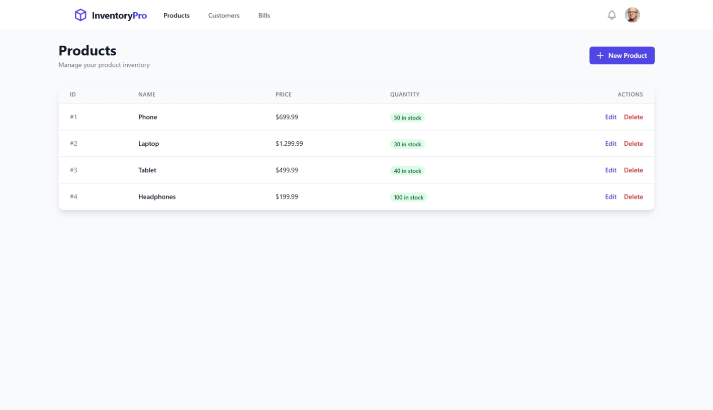
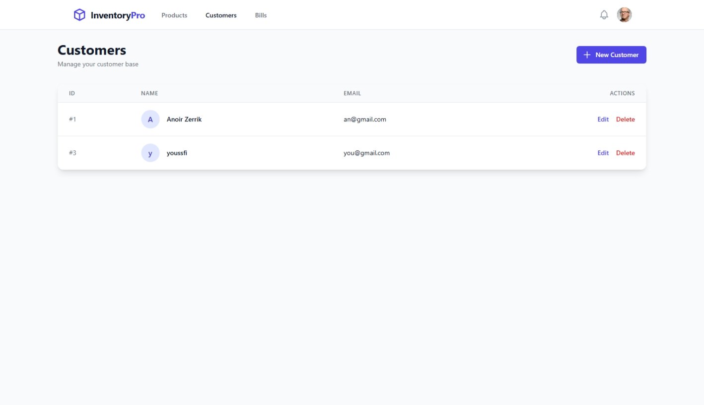
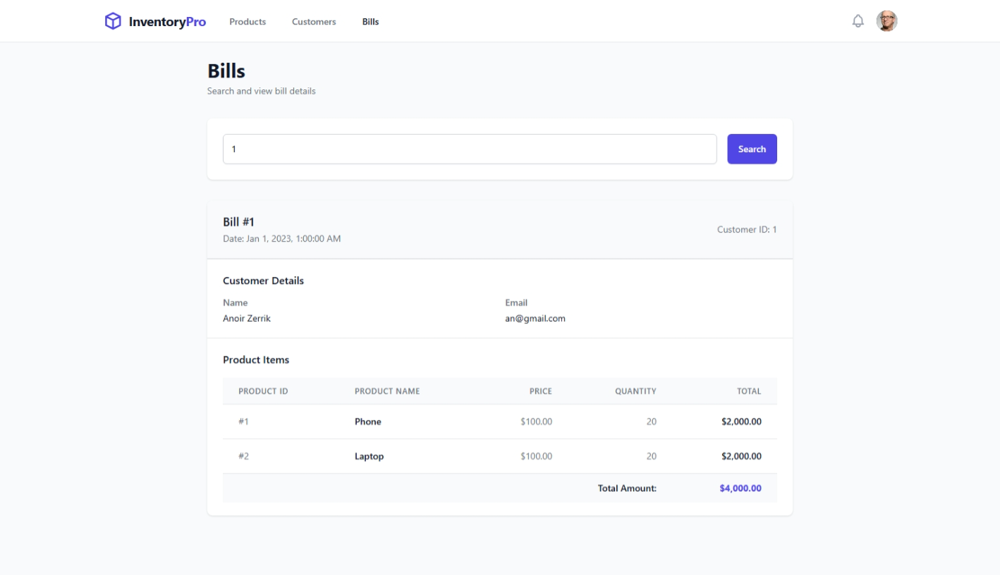

# Inventory Management System - Frontend

A modern inventory management application built with Angular and Tailwind CSS. This application provides a clean and intuitive interface for managing products, customers, and bills.

## 📸 Screenshots

### Products Management

*Product listing and management interface*

### Customers Management

*Customer listing and management interface*

### Bills

*Bill search and display interface*

## 🚀 Features

- **Product Management**: Create, read, update, and delete products
- **Customer Management**: Manage customer information with full CRUD operations
- **Bill Management**: Search and view bills
- **Responsive Design**: Modern UI built with Tailwind CSS
- **Real-time Updates**: Uses Angular Signals for reactive state management
- **Skeleton Loading**: Smooth loading states for better UX

## 🛠️ Tech Stack

- **Framework**: Angular 19.2
- **Styling**: Tailwind CSS 3.4
- **State Management**: Angular Signals
- **HTTP Client**: Angular HttpClient
- **Backend API**: Microservices architecture via Spring Cloud Gateway

## 📋 Prerequisites

- Node.js (v18 or higher)
- npm (v9 or higher)
- Backend API running at `http://localhost:8888/INVENTORY-SERVICE`

## 🔧 Installation

1. Clone the repository:
```bash
git clone <repository-url>
cd inventory-frontend-app
```

2. Install dependencies:
```bash
npm install
```

3. Configure the API endpoint (if needed):
   - Update the API URL in service files located in `src/app/services/`

## 🏃 Running the Application

### Development Server

```bash
npm start
```

Navigate to `http://localhost:4200/`. The application will automatically reload when you make changes.

### Production Build

1. Build the application:
```bash
npm run build
```

2. Serve the production build:
```bash
npx http-server dist/inventory-frontend-app/browser -p 4200
```

## 📁 Project Structure

```
src/
├── app/
│   ├── components/
│   │   └── header/          # Header component
│   ├── models/              # Data models
│   │   ├── product.ts
│   │   ├── customer.ts
│   │   └── bill.ts
│   ├── pages/               # Page components
│   │   ├── products/
│   │   ├── customers/
│   │   └── bills/
│   └── services/            # API services
│       ├── product.service.ts
│       ├── customer.service.ts
│       └── bill.service.ts
└── styles.css               # Global styles
```

## 🎨 UI Components

- **Professional CRM-style Tables**: Clean, modern data tables with hover effects
- **Modal Forms**: Intuitive forms for creating and editing records
- **Skeleton Loaders**: Smooth loading states
- **Responsive Navigation**: Clean header with navigation links

## 🔌 API Integration

The application connects to a microservices backend through Spring Cloud Gateway:

- **Base URL**: `http://localhost:8888/INVENTORY-SERVICE`
- **Endpoints**:
  - Products: `/api/products`
  - Customers: `/api/customers`
  - Bills: `/api/bills`

## 📝 Available Scripts

- `npm start` - Start development server
- `npm run build` - Build for production
- `npm test` - Run unit tests
- `npm run watch` - Build in watch mode

## 🤝 Contributing

1. Fork the repository
2. Create your feature branch (`git checkout -b feature/AmazingFeature`)
3. Commit your changes (`git commit -m 'Add some AmazingFeature'`)
4. Push to the branch (`git push origin feature/AmazingFeature`)
5. Open a Pull Request

**Note**: Make sure the backend microservices are running before starting the frontend application.
